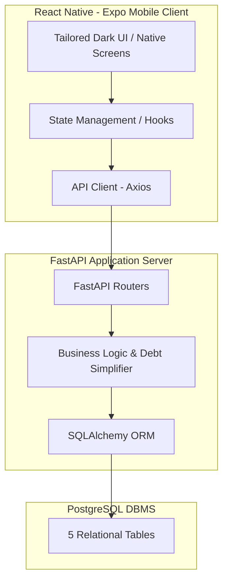
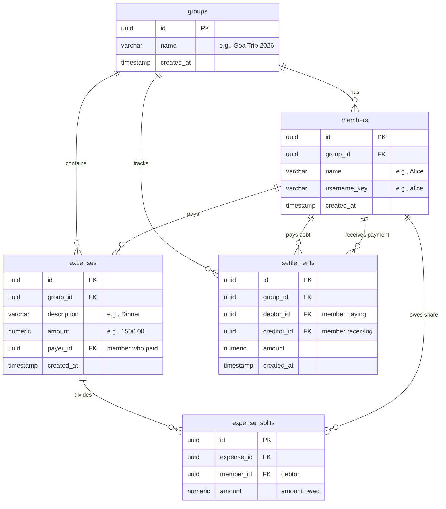
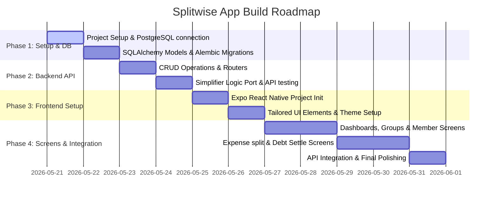

# Implementation Plan: Splitwise-like Expense Sharing App

This document outlines the detailed architecture and step-by-step roadmap to build a premium, production-ready **Expense Sharing App** inspired by Splitwise. It transitions the terminal-based logic in [main.py](file:///d:/Dbms_project/main.py) into a robust **FastAPI backend** (backed by **PostgreSQL**) and a stunning **React Native (Expo) frontend**.

---

## 🏛️ System Architecture

---

## 🗄️ Database Design (PostgreSQL - 5 Tables)

To satisfy the minimum 5 tables requirement and support all features in the logic, we will implement the following relational schema:

### Table Definitions

1. **`groups`**: Represents individual trips, events, or shared groups.
   - `id`: `UUID` (Primary Key)
   - `name`: `VARCHAR(100)` (Not Null)
   - `created_at`: `TIMESTAMP` (Default: `CURRENT_TIMESTAMP`)

2. **`members`**: People associated with a specific group.
   - `id`: `UUID` (Primary Key)
   - `group_id`: `UUID` (Foreign Key referencing `groups.id`, ON DELETE CASCADE)
   - `name`: `VARCHAR(100)` (Not Null)
   - `username_key`: `VARCHAR(100)` (Not Null, lowercase representing the unique ID within group context)

3. **`expenses`**: Individual expenses logged.
   - `id`: `UUID` (Primary Key)
   - `group_id`: `UUID` (Foreign Key referencing `groups.id`, ON DELETE CASCADE)
   - `description`: `VARCHAR(255)` (Not Null)
   - `amount`: `DECIMAL(10, 2)` (Not Null)
   - `payer_id`: `UUID` (Foreign Key referencing `members.id`, ON DELETE CASCADE)
   - `created_at`: `TIMESTAMP` (Default: `CURRENT_TIMESTAMP`)

4. **`expense_splits`**: Relates who owes how much for a specific expense.
   - `id`: `UUID` (Primary Key)
   - `expense_id`: `UUID` (Foreign Key referencing `expenses.id`, ON DELETE CASCADE)
   - `member_id`: `UUID` (Foreign Key referencing `members.id`, ON DELETE CASCADE)
   - `amount`: `DECIMAL(10, 2)` (Not Null)

5. **`settlements`**: Records payments made between members to settle balances.
   - `id`: `UUID` (Primary Key)
   - `group_id`: `UUID` (Foreign Key referencing `groups.id`, ON DELETE CASCADE)
   - `debtor_id`: `UUID` (Foreign Key referencing `members.id`, ON DELETE CASCADE)
   - `creditor_id`: `UUID` (Foreign Key referencing `members.id`, ON DELETE CASCADE)
   - `amount`: `DECIMAL(10, 2)` (Not Null)
   - `created_at`: `TIMESTAMP` (Default: `CURRENT_TIMESTAMP`)

---

## ⚡ FastAPI Backend Endpoints

The backend will expose a clean, RESTful JSON API using **FastAPI** and **SQLAlchemy**.

### Group & Member Management
- `POST /api/groups` - Create a new group/trip record.
- `GET /api/groups` - Retrieve all groups (with summaries of total expenses).
- `GET /api/groups/{group_id}` - Fetch single group info with members and details.
- `POST /api/groups/{group_id}/members` - Add a list of members to the group.

### Expense & Split Logging
- `POST /api/groups/{group_id}/expenses` - Log a new expense (calculates splits automatically based on selection).
- `GET /api/groups/{group_id}/expenses` - List all expenses with payer details and split ratios.
- `DELETE /api/groups/{group_id}/expenses/{expense_id}` - Delete/revert an expense.

### Balance Calculation & Debt Simplification
- `GET /api/groups/{group_id}/balances` - Computes raw balances and net balances for all members:
  $$\text{Net Balance} = \text{Total Paid} - \text{Total Owed} + \text{Total Settlements Paid} - \text{Total Settlements Received}$$
- `GET /api/groups/{group_id}/simplified-debts` - Performs the **greedy debt-simplification algorithm** (from `main.py`) to minimize transaction counts:
  1. Identify all net creditors (positive net balances) and net debtors (negative net balances).
  2. Sort debtors and creditors descending by absolute balances.
  3. Greedily match the largest debtor with the largest creditor, settle the minimum of their balances, and adjust until all balances are resolved.
- `POST /api/groups/{group_id}/settlements` - Record a manual transaction between a debtor and creditor to reduce debt.
- `POST /api/groups/{group_id}/reset` - Settle all debts completely (clears expense history and splits for a fresh start, similar to Option 3 in `main.py`).

---

## 📱 React Native Frontend UI

The user interface will be built using **React Native with Expo** to guarantee cross-platform support. It will showcase a premium, dark-mode glassmorphic aesthetic to wow the user.

### Key Screens & UX Mockup Flow

#### 1. Home Dashboard (`index.tsx`)
- **Visuals**: Modern dark background, clean linear gradients, card list representing active trips/groups.
- **Metrics**: Global "You owe" vs "You are owed" indicators at the top.
- **Interactions**: Float button `+ New Record` to launch the creation flow.

#### 2. Group Detail Page (`[group_id].tsx`)
- **Header**: Large bold group name with quick stats (Total Group Spending).
- **Tabs**:
  - 📝 **Expenses**: Scrollable feed of logged expenses (who paid what, dates, clean cards).
  - ⚖️ **Balances & Debts**:
    - **Raw Pairwise Balances**: Shows who owes who.
    - **Simplified Balances**: Highlighting the minimum transactions recommended (e.g., "Bob owes Alice $33.33").
    - **Settle Button**: Instantly record a payment between two members.
  - 👥 **Members**: Manage/view participants.

#### 3. Create Group / Add Members (`create-group.tsx`)
- Form to name the record (e.g., "Goa Trip").
- Interactive chips for adding/removing members dynamically.

#### 4. Add Expense Modal (`add-expense.tsx`)
- Form input for expense name, total amount, payer dropdown.
- **Split Customization**:
  - Toggle between **"Split with Everyone"** and **"Split with Specific People"**.
  - Interactive multi-select checklists to toggle people.
  - Live calculations showing what each person will owe before submitting.

---

## 🎨 Design & Aesthetic Goals (Premium Dark Mode)

To make this application look state-of-the-art:
- **Typography**: `Outfit` or `Inter` via Google Fonts.
- **Color Palette**:
  - Background: Sleek Obsidian (`#0F172A`)
  - Surface: Translucent Dark Slate (`rgba(30, 41, 59, 0.7)`) with fine white border overlay (`rgba(255,255,255,0.05)`)
  - Primary Accent: Indigo Purple (`#6366F1`)
  - Positive/Credit: Vibrant Teal (`#10B981`)
  - Negative/Debt: Warm Coral (`#F43F5E`)
- **Visual Elements**: Subtle box shadows, high contrast text hierarchies, beautiful custom SVGs/vector icons, and micro-interactions (smooth transitions, animated tab switches).

---

## 🚀 Execution & Implementation Roadmap

---

### Step-by-Step Implementation Guide

### Step 1: Initialize Project Structure
Create folders `backend/` and `frontend/` in `d:\Dbms_project`.

### Step 2: Establish the PostgreSQL & FastAPI Core
Create `backend/database.py`, `backend/models.py`, `backend/schemas.py`, and `backend/main.py`. Test connections and perform model creation.

### Step 3: Implement Business Logic
Port the balance calculation and greedy simplified debt resolution directly into a dedicated service layer `backend/services/solver.py`.

### Step 4: React Native / Expo Mobile App Setup
Run `npx create-expo-app frontend --template tabs` or similar to set up standard Expo Router pages. Add custom styles for the obsidian dark-mode interface.

### Step 5: End-to-End API Integration
Connect client calls via a central API service, adding visual overlays and micro-animations to highlight splits and settlement completions.
